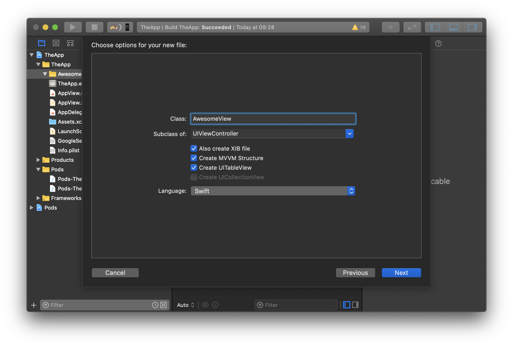
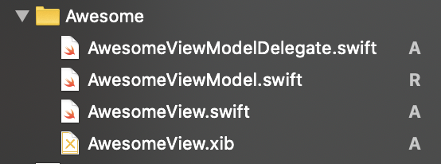

# Candies

### Templates

---

> All Templates can be installed by simply executing the **PlaceTemplates.command** file.

---

### Cocoa Touch Class.xctemplate

Configuration:

Will create the following scructure:

> 

---

### Foundation Extensions

* String+Mask.swift
* UserDefault.swift

### UIComponents

* UICPFCNPJTextField.swift
* UIRoundedView.swift
* UIShadowView.swift

### UIExtensions & UIProtocols

* Dequeuable.swift
